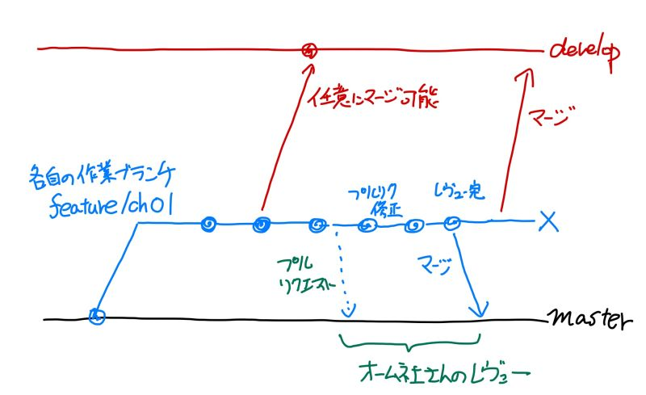

# ブランチ運用メモ（仮）

GitHubを用いたブランチ運用方法についてメモ的にまとめます。すべて仮案です。

## 1. ブランチ運用概要（案）とブランチの種類

### 1.1 ブランチ運用概要（案）

GitHub上でのブランチ運用案として仮に以下のフローを記載しておきます。

いちおう、（ほとんど意味はないでしょうが）developブランチに中間で作成した文書をマージできるようにしておきます。

### 1.2 ブランチの種類

上記運用フローを踏まえたブランチの種類は以下となります。

| ブランチ名（種類名） | 位置づけ |
|:----|:--------|
| masterブランチ | オーム社さん側でのレビューが完了したデータをこちらに置くこととします。 |
| feature/chXXブランチ | XXは各章No。各章の担当者が作業/レビュー用に使う。 |
| developブランチ | 作業途中のデータをマージしてもよい場所とします。中間進捗確認用程度。 |

## 2. 翻訳時のGitブランチ運用方法

各担当者は自分の担当章のfeature/chXX（XXに章番号を入れる）を作成し、そのブランチで作業ください。半分ほどできた段階でdevelopにマージいただくのは任意で行ってください。

各章の翻訳完了した場合には、masterブランチにプルリクエストを行って、オーム社の石田さんにレビューを行っていただくことを考えております。

担当者とレビュー担当者の2名程度での作業となると予想しております。レビューや修正を行う場合のプルリクなどの方法については各自におまかせしておきます。

## 3. オーム社さんのレビュー時のブランチ運用方法

オーム社さんへのレビューは各自の作業ブランチのfeature/chXXの成果物をオーム社さんに見てもらうか、masterへのプルリクエストを行ったうえでレビューなどを行ってください。

masterへのプルリクを行った際のレビュー方法は次のようになります。

（後で追記）

## 4. 環境改善例（設定ファイル、マニュアル）

本文書のようなマニュアル、.textlintrcのような設定ファイルはmasterへ直接更新ください。
