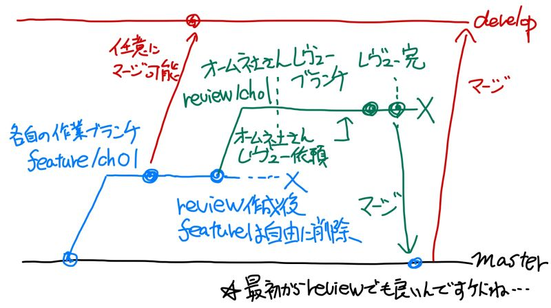

# ブランチ運用メモ（仮）

GitHubを用いたブランチ運用方法についてメモ的にまとめます。すべて仮案です。

## 1. ブランチ運用概要（案）とブランチの種類

### 1.1 ブランチ運用概要（案）

GitHub上でのブランチ運用案として仮に以下のフローを記載しておきます。

いちおう、（ほとんど意味はないでしょうが）developブランチに中間で作成した文書をマージできるようにしておきます。

### 1.2 ブランチの種類

上記運用フローを踏まえたブランチの種類は以下となります。

| ブランチ名（種類名） | 位置づけ |
|:----|:--------|
| masterブランチ | オーム社さん側でのレビューが完了したデータをこちらに置きます。 |
| feature/chXXブランチ | XXは各章No。各章の担当者が作業/レビュー用に使う。 |
| developブランチ | 作業途中のデータをマージしてよい場所とします。中間進捗確認用程度。 |

## 2. 翻訳時のブランチ運用方法

各担当者は自分の担当章のfeature/chXX（XXに章番号を入れる）を作成し、そのブランチで作業ください。半分ほどできた段階でdevelopにマージいただく、という手続は任意で行ってください。

各章の翻訳完了した場合には、masterブランチにプルリクエストを行って、オーム社の石田さんにレビューを行っていただく想定です。

翻訳チーム側の作業は担当者とレビュー担当者の2名程度での作業となると予想しております。レビューや修正を行う場合のプルリクなどの方法については各自におまかせします。

## 3. オーム社さんレビュー時のブランチ運用方法

オーム社さんへのレビューは各自の作業ブランチのfeature/chXXの成果物をオーム社さんに見てもらうか、masterへのプルリクエストを行ったうえでレビューなどを行ってください。

masterへのプルリクを行った際のレビュー方法は次のようになります。

### 3.1 レビュー時の翻訳担当者の作業前提

- 翻訳担当者がプルリクエスト後、オーム社さん（石田さん）に連絡する
- 以下2つの連絡を入れる

    1. レビュー対象のブランチ/章データ
    2. プルリクリンク

### 3.2 オーム社さん側の確認手順（シーン毎）　※途中です。

#### A) 文書を確認する場合

文書を確認する場合、該当章のリンクが連絡されていればそちらのリンクを確認ください。
GitHub上では、該当のブランチを選択してファイルを確認ください。

#### B) 指摘コメントを入れる場合

プルリクエストに対しての指摘コメントもしくはIssueでのコメントが可能です。

#### C) 直接修正する場合（ブラウザでの手順）
	
いくつか方法がありますが、該当のファイルを直接修正可能ですので、その手順でもよいです。別途プルリクを行っても構いません。

## 4. 環境改善方法（設定ファイル、マニュアル）

本文書のようなマニュアル、.textlintrcのような設定ファイルはmasterへ直接更新ください。
textlint関連のファイルは他の章へ影響がある可能性があるため、更新前に各章のlintを実施して問題がないか確認することを推奨します。

なお、textlint設定の調整方法に関しては、[こちら](../textlint/README.md)の「3. textlintルール対応参考（緩和方法、追加方法など）」を確認ください。
