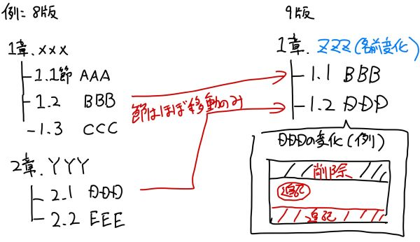

# マネジメント情報、第6版情報など

今回のプロジェクトの分担、ツール、過去第6版情報などをまとめておきます。

## 1. 分担、体制

以下を参考に分担を確認ください。基本方針は「部単位でチームを組んで活動し、そのチーム内でなるべく文書表現などを統一できる進め方をする」とします。

- [分担参考](https://docs.google.com/spreadsheets/d/1y0pnQ1dw7dsS9S-NleFppV7_rzgG-F4O/edit#gid=1032535721)

参考：各部の担当について仮見込み（超仮の内容、キックオフで調整します）

- 1部：みずの（ほとんど完成）
- 2部：岡澤さん、井芹さん、（松尾さん）
- 3部：鈴木カズさん、根本さん、マス金子、（松尾さん）、（調整中）
- 4部：池田さん、山崎さん、（調整中）
- 5部：マス金子、みずの、（調整中）
- Appendix：松尾さん、みずの

## 2. 書籍関連情報

（今後手に入った場合）原著データ、第6版の日本語PDFデータを以下に置きます。

- [原著データ（現状リンクなし）](http)
- [第6版の日本語PDFデータ](https://drive.google.com/drive/folders/1PqOO8_2QOH2vWtB-ijhwSyVO7A5_CQ39)

### 2.1 参考情報：SEPA（実践ソフトウェアエンジニアリング）の改版傾向

第6版を参考とされる方も第8版を第9版に移行する方もこちらを確認しておくと便利かもしれません。

- SEPAは改版のたびに目次構成を変える傾向があります
- こちらの変更ですが、章タイトルは変わりますが「節」レベルでは変わってない場合も多いです
- なので、節単位で同じタイトルの内容があれば、ほぼコピペで済むかもしれません
- ただし、↑のコピペだとしれっと変わってる部分があるので注意です（過去50年→60年という記述など）

## 3. 使用ツール（コミュニケーション系）

コミュニケーションとして以下のツールを使います。（あくまでわすれた時向け程度のメモ）

- [GitHub環境](https://github.com/mizunori/sepa_9th)
- [Slack](https://sepa-trans.slack.com)
- [Google Drive](https://drive.google.com/drive/folders/1icfVZFjA3yQT7D1YscOCJ_8BY9SpCEyQ)

## 4. タスク管理・進捗管理方法

進捗管理はGitHubの以下状況で確認かなと。タスク管理ツールは使いません。

- 各章のfeatureブランチ作成状況
- ブランチがfeature/reviewに変更したかどうか
- オーム社さんレビューが完了してmasterにマージした度合

できなさそうなら早めにアラーム上げてくださいな。

初期はやり方の共有で全体の打合せを少し頻度多めに実施、中間以降は2か月に1回くらいの確認をするくらいかなと考えてます。

## 5. （別論点）翻訳担当者への経費の支払いについて

翻訳プロジェクトの進め方とは関係ありませんが、各担当者の皆様へ経費の支払いができる状況かと考えております。以下を参考にみずのまで請求してください。

### 参考：印税についての方針

- 今回の書籍は「手に入れてもらうためできる限り安くする」ため、印税の割合を最低限としてます
- たぶん翻訳者側の利益は殆どでないと思ってください…
- あわせて、黒字が出たとしても寄付なり打ち上げなりで利益ゼロとする予定です（打ち上げはやる）
- 上記の状況ですが、担当者の方に損とならないよう、経費支払いは作業段階からできるようにします
- 経費はみずの個人事業分でひとまずカバー、後ほど印税で回収とさせて頂く予定です

以下提案
- 2021はわかりませんが、2022以降はコミュニティの支援なりに使えればとも思います。
- イベントで費用を確保したい場合など、それほど多くない金額であれば補助できるかと。
- 下記同等の申請フォームで対応できるようにすることを考えてます。

### 経費の範囲

ひとまず以下の範囲で対応します。下記申請フォームに記入いただいて振り込みを行う予定です。（日付は2021年からでお願いします…）

- 過去の第8版、今回の第9版を購入した場合も含めた書籍代金
- 担当章に出てくる参考文献の日本語版を購入した場合の書籍代金
- その他、今後（ほぼ無さそうですが…）交通費等が発生した場合の費用

以下提案：2021年以降
- コミュニティ関連の費用について、Slackで連絡してフォームに書いてもらえれば（年間分まとめてとかになりそうですが）振り込みしておこうと思います。

### 申請フォーム

以下リンクのExcelに記述してSlackなどで提出してください。（書籍用と交通費用に分ける予定）
- [申請フォームExcel置き場](https://drive.google.com/drive/folders/1x3SOd2pa2QsWHYNkljfEPzMvWEGZZvwD)

領収書やレシートなどがあれば、写真撮るなりPDFなりで添付可能ならお願いします。（無くてもOK、過去の内容も申請しておいてください）

