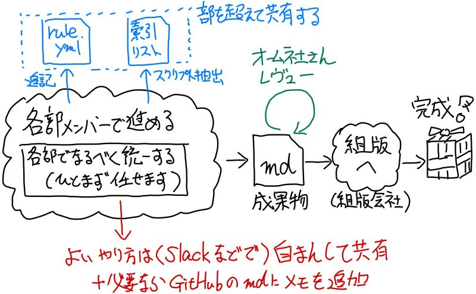

# 各章の作業プロセスおよびレビュー案（簡易、仮）

今回のプロジェクトのチーム体制を前提として各章の作業プロセスをまとめてます。

この辺は各担当が1章の半分ほど訳した段階で見直しましょう…

## 1. 各章の完成までの作業イメージ

各章の担当者における完成までの作業イメージを以下の図で記載します。

具体的な進め方は本文書の「3. 基本的な方針」と「4. （想定課題を考慮した）レビューとプロセスによる活動方針」を参考としてください。

簡単に、以下の順で考えてます。

- 各部メンバーで表現統一などをしつつ、各章を完成させる（用語統一は別記述参考）
- オーム社さんのレビューをGitHub上に実施
- オーム社さんレビュー関連にて、組版会社作業 -> 該当章の完成へ

なお、GitHub上での作業はオーム社さんレビューまでとなります。組版実施後の修正については、組版データ（PDF？InDesign？）を直接修正することとなります。

最後に用語チェックを行い、一部用語を置換すると予想しておりますが、この作業は組版データ上で行う可能性が高いです。

## 2. 想定課題

以下のような課題、心配ごとへの対応を考えてます。

- 過去クロスレビューで進めようとしたがうまくいかなかった
    - 並列でやってる状況で相互レビューはきつい
- 技術用語を正しく使っているか心配
- 英語と対応してない日本語にしちゃうかも
- 他の章と訳や表現がバラバラになるかも
- 読みづらい日本語になってるかも
- 細かい単語含めてできれば統一したい

## 3. 基本的な方針

以下方針を考えています。

### A) 各「部」単位の体制で用語は揃えるようにしてもらう

やり方は自由です。できる限り部の単位で色をそろえてもらえると嬉しいです。

### B) 「部」を超えて共有するもの

以下2点は部を超えて共有できればよいかと考えてます。

1. 索引レベルの用語は共有して部を超えて対訳を統一するよう務める

    - [こちら](../manual/README.md)の「 I) 索引向けの単語 」を参照のこと
    - スクリプトで索引用語は拾えるようにしてます（まだ改善余地があるので考えてます…）
    - 索引一覧のデータを共有して、対訳のブレを減らしたいと考えてます
    - カンペキにはできないので、できる程度で…というくらいです

2. 用語の揺らぎは各部メンバーで気づいた分をrule.ymlに適用

    - 部の単位で書き留めてもらってマージし、最後に一括適用するとよさそうです

## 4. （想定課題を考慮した）レビューとプロセスによる活動方針

レビュー観点とレビュー、プロセスでの対応について、対課題という形式で書いておきます。（仮ですね…）

1. 過去クロスレビューで進めようとしたがうまくいかなかった

    少なくともやり方は変えます。下記の課題対策の観点ベースで進めます。

2. 技術用語を正しく使っているか心配（観点：技術用語）

    必要に応じてスペシャリスト（内部or外部）に依頼予定です。初期段階で必要性を確認します。

3. 英語と対応してない日本語にしちゃうかも（観点：英語日本語対応）

    比較的信じてます。この観点で相互レビューはやらない予定です。ひとまず、相談型で担当者が気になるところをレビュー（相談受付）するようにしましょう。

4. 他の章と訳や表現がバラバラになるかも（観点：他章との統一）

    「3. 基本的な方針」に記載の「B) 「部」を超えて共有するもの」を参考にある程度ガードしようと考えてます。あとは、各部のメンバーで何かルールや仕組みを適用するなら試して（うまくいったら共有して）ください。

    カンペキにはできないので、Good Enoughを目指すくらいかなと。

5. 読みづらい日本語になってるかも（観点：読みやすさ）

    オーム社さんレビュー＋αで対応予定です。こちらも比較的信じてます。表現を迷った場合、相談しながら進めるとよいでしょう。

6. 細かい単語含めてできれば統一したい（観点：該当章内の統一、他章との統一）

    ムリじゃないかと思ってます。各部で繰り返し出てくる用語・表現はできれば統一ください。JSTQBやPMBOKを引用する前提とかのルールはあってもよいかもです。
