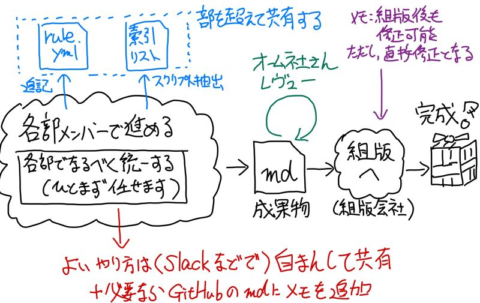

# 各章の作業プロセスおよびレビュー案（簡易、仮）

今回のプロジェクトのチーム体制を前提として各章の作業プロセスをまとめてます。

## 1. 各章の完成までの作業イメージ

各章の担当者における完成までの作業イメージを以下の図で記載します。

具体的な進め方は本文書の「3. 基本的な方針」と「4. （想定課題を考慮した）レビューとプロセスによる活動方針」を参考としてください。

## 2. 想定課題

各担当者は自分の担当章のfeature/chXX（XXに章番号を入れる）を作成し、そのブランチで作業ください。半分ほどできた段階でdevelopにマージいただく、という手続は任意で行ってください。

各章の翻訳完了した場合には、masterブランチにプルリクエストを行って、オーム社の石田さんにレビューを行っていただく想定です。

翻訳チーム側の作業は担当者とレビュー担当者の2名程度での作業となると予想しております。レビューや修正を行う場合のプルリクなどの方法については各自におまかせします。

## 3. 基本的な方針

オーム社さんへのレビューは各自の作業ブランチのfeature/chXXの成果物をオーム社さんに見てもらうか、masterへのプルリクエストを行ったうえでレビューなどを行ってください。

masterへのプルリクを行った際のレビュー方法は次のようになります。

## 4. （想定課題を考慮した）レビューとプロセスによる活動方針

本文書のようなマニュアル、.textlintrcのような設定ファイルはmasterへ直接更新ください。
textlint関連のファイルは他の章へ影響がある可能性があるため、更新前に各章のlintを実施して問題がないか確認することを推奨します。

なお、textlint設定の調整方法に関しては、[こちら](../textlint/README.md)の「3. textlintルール対応参考（緩和方法、追加方法など）」を確認ください。
